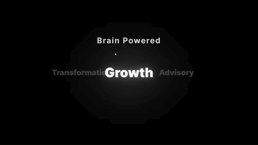

🎬 Cinematic Preloader Demo

A visually refined React application featuring a content-aware, dynamic word-cycling preloader built with Framer Motion and styled using Tailwind CSS v4.
Designed to deliver a smooth, cinematic, premium loading experience.

✨ Preview

🖼️ Preloader Demo
 

💡 Key Feature: Elegant Preloader

ElegantPreloader is the hero of this project — engineered with precision for an elevated user experience.

Feature	Description
🎞️ Cinematic Flow	Words glide seamlessly into the center with natural, fluid motion.
💋 “Perfect Kissing Gap”	Dynamic width detection ensures each word aligns exactly with a center-kiss effect.
📏 Content-Aware Offsets	Spacing adjusts automatically to any word length.
⚡ Framer Motion Power	Hardware-accelerated transitions with AnimatePresence.
🎨 Modern Styling	Clean, utility-driven UI with Tailtailwindv4 CSS v4.
🛠️ Tech Stack

React 19 (via Vite)

TypeScript

Vite + SWC (@vitejs/plugin-react-swc)

Framer Motion v12

Tailwind CSS v4

PostCSS pipeline

🚀 Getting Started
Prerequisites

Make sure you have installed:

Node.js (LTS recommended)

npm / yarn / pnpm

📦 Installation

Clone the repository:

git clone <your-repo-url>
cd my-react-app

Install dependencies:

npm install
# or yarn install
# or pnpm install

🔧 Available Scripts
Command	What It Does
npm run dev	Runs the dev server with HMR (http://localhost:5173)
npm run build	Bundles the production build
npm run preview	Serves the production build locally
npm run lint	Runs ESLint
🎨 Tailwind CSS v4 Setup

Tailwind v4 is streamlined.
Your src/index.css contains:

@import "tailwindcss";

/* Add your global styles here */

No clutter. Pure simplicity.

🎥 Why This Project Exists

This preloader is not just functional — it’s a micro-experience.
It elevates your app’s first impression, making loading feel intentional and cinematic.

Perfect for:

Portfolios

Creative apps

Content platforms

UI/UX showcases

Motion-styled projects